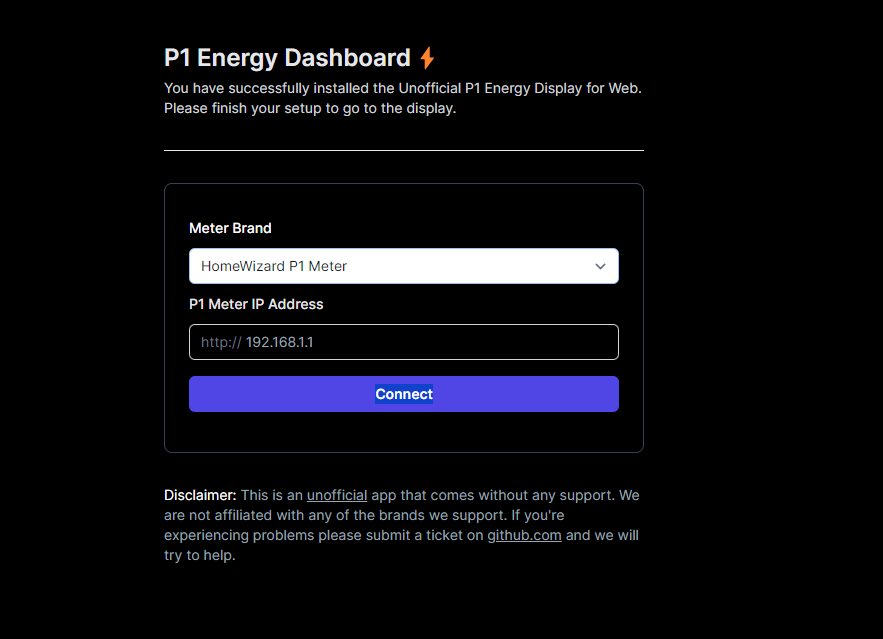
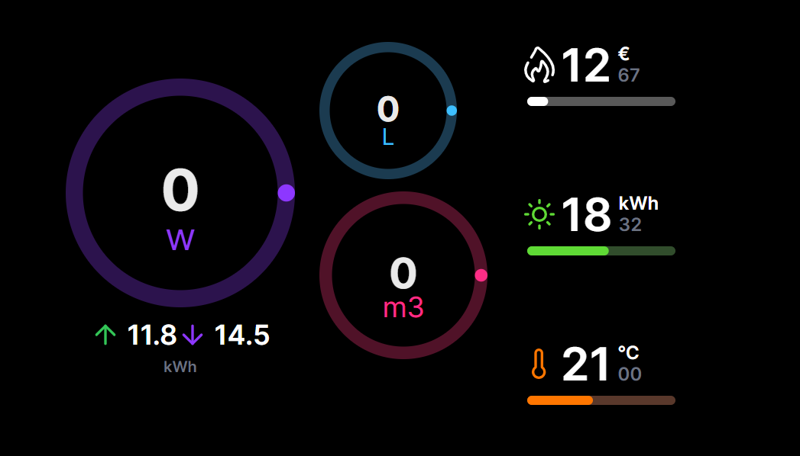

## Selfhosted Homewizard Energy Display for Web

A selfhosted web ui version of the HomeWizard Energy Display used with the HomeWizard P1 meter. Currently in development.

> Currently this whole system is purely an empty shell there is no connectivity with a backend server yet or meter.

### Setup

Once finished, you can configure your Energy Display in your browser by settings its IP and choosing your meter (there is a plan to support more smart meters) and saving your settings.

### Dashboard

After everything is finished, you will be redirected to your dashbaord.

